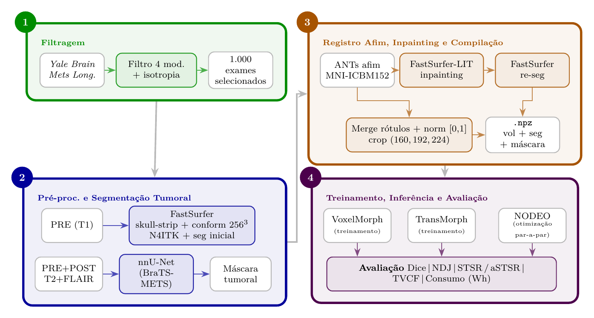

# Pipeline baseado em aprendizado profundo para registro de imagens médicas com preservação de volumes tumorais

Deformable brain-MRI registration with tumor-volume preservation (NODEO, VoxelMorph, TransMorph, each ±VP) on Yale Brain Mets.



## Layout

- `common/`: shared losses/metrics/energy
- `phase1_filter/` → `phase2_preprocess/` → `phase3_inpaint/` → `phase4_train_eval/models/{transmorph,voxelmorph,nodeo}/`.
- `phase5_results/`: post-pipeline. Plots results, builds tables/figures. Not a pipeline step — the pipeline itself is the four steps above.

Run order + commands: see **RUNBOOK.md**.

## Environments

In the research, the miniconda tool was used to manage Python environments.

- `transmorph` — all 3 registration models + atlas/ANTs prep. `torch==2.10.0+cu128`.
  Install: `pip install -r requirements.txt` (+ voxelmorph step below).
- `fastsurfer` — FastSurfer, FastSurfer-LIT, nnU-Net (BraTS-METS). `nnunetv2`, `monai`.
  Install: `pip install -r requirements-fastsurfer.txt` (+ clone FastSurfer below).
Full pip freezes of the reference machine in `env_snapshots/`.

## External tools (NOT vendored) — pinned to the versions this work ran on

- **FastSurfer** — clone at commit `0b6c508` (`v2.4.2-270-g0b6c508`):

  ```
  git clone https://github.com/Deep-MI/FastSurfer.git
  git -C FastSurfer checkout 0b6c508d36d3ab74c42b4ab3ae9941a5c668508f
  ```

  Place the clone at the repo root (`./FastSurfer/`); needs a FreeSurfer license
  (`FS_LICENSE`). Passed to scripts via `--fastsurfer-bin FastSurfer/run_fastsurfer.sh`.
- **FastSurfer-LIT** (`neurolit`) — pinned commit `d23f6d0`, installed by
  `requirements-fastsurfer.txt`:
  `git+https://github.com/Deep-MI/LIT.git@d23f6d0ca54426e151970133f257eab827961747`.
- **voxelmorph** (Blackwell/Py3.11):

  ```
  pip install "git+https://github.com/voxelmorph/voxelmorph.git@9bde7a270edfc19ad1c61115cb5ebd82124ee3af"
  d=$(python -c "import voxelmorph,os;print(os.path.dirname(os.path.dirname(voxelmorph.__file__)))")
  patch -p1 -d "$d" < third_party_patches/voxelmorph_py311_blackwell.patch
  ```

  Always set `VXM_BACKEND=pytorch`.
- **nnU-Net weights** — BraTS-METS-2025 winner; download into `brats_local/results` + `brats_local/raw`.

## Blackwell (RTX 50 / sm_120) caveat

Needs CUDA-12.8 / `+cu128` PyTorch. Upstream authors' pre-trained weights are incompatible — models were trained from scratch.

## Data (not included — supply at repo root)

- **Dataset/** — Yale Brain Mets Longitudinal . Layout: `Dataset/MRI/<patient>/<exam>/*_{PRE,POST,T2,FLAIR}.nii.gz`.
- **Atlas/** — MNI ICBM152 2009c nonlinear-symmetric template (`mni_icbm152_nlin_sym_09c_nifti`, T1 + mask), unzipped into `Atlas/`.
  - Step 2.1 (`prepare_mni_template.py` → padded T1, then `prepare_atlas_fastsurfer_seg.py` → FastSurfer atlas seg) derives the products the pipeline reads: `mni_icbm152_t1_padded[_160x192x224].nii.gz`, `fastsurfer_seg_160x192x224.nii.gz`.
- **brats_local/{results,raw}** — nnU-Net BraTS-METS-2025 weights (see above).

All produced intermediates stay in-repo: FastSurfer brain-seg → `./fastsurfer_output/`, preprocessed npz → `./data/`, tumor masks → `./tumor_masks_conformed/`, checkpoints/results → `./checkpoints*/`, `./result/`.
All gitignored.
